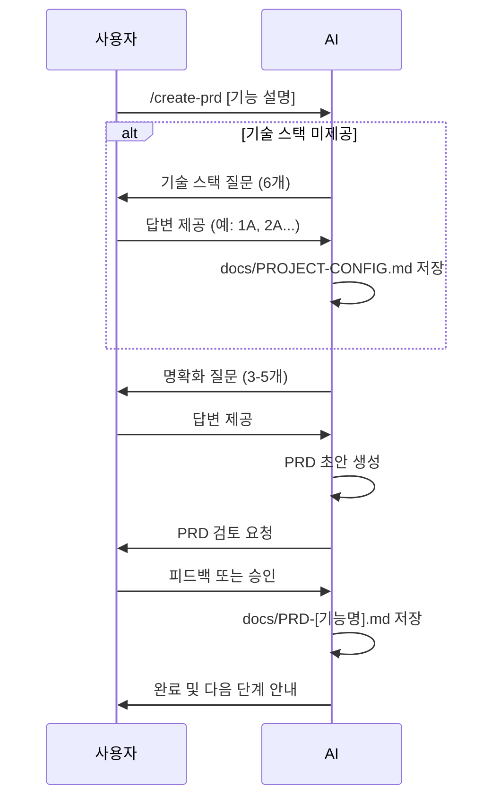

# PRD 생성 프롬프트

> [!NOTE]
> **문서 독자**: 한국인 개발자 + AI 에이전트
> **언어 규칙**: 문서는 **한국어**로 작성하되, 핵심 기술 용어는 **영어**를 사용하거나 **한국어 (English)** 형식을 사용합니다.

이 프롬프트를 사용하여 기능에 대한 PRD(Product Requirements Document, 제품 요구사항 문서)를 생성합니다.

## 워크플로우 개요



## 사용법

```
/create-prd

[기능 설명을 여기에 입력하세요]
```

## 지침

당신은 제품 요구사항 문서(PRD)를 작성하는 제품 관리자입니다. 사용자의 기능 요청을 기반으로 명확하고 실행 가능한 PRD를 작성해주세요.

### 프로세스 (Deep Reasoning & Schema Check)

> [!IMPORTANT]
> 모든 분석 및 결정 과정은 반드시 XML 태그 안에 작성하여 명확히 구분해야 합니다.

#### 0단계: 기본 설정 및 환경 분석 (System Integrity Check)
`<system-check>`
1. **Config Validation**: `docs/PROJECT-CONFIG.md` 존재 여부 확인.
2. **Context Scanning**: 
   - 프로젝트 루트의 설정 파일(`package.json`, `tsconfig.json` 등) 스캔.
   - 현재 열려있는 파일 및 의존성 그래프 분석.
3. **Tech Stack Verification**: 요청된 기능이 현재 기술 스택과 호환되는지 검증.
   - 예: "React 프로젝트에 Vue 컴포넌트를 요청했는가?"
</system-check>

#### 1단계: 요구사항 수집 및 연구
`<input-analysis>`
사용자의 초기 요청을 분석하고, 불명확한 점이 있다면 `research_mode`를 고려합니다.
- 요구사항이 모호한 경우: 질문 리스트 생성.
- 기술적 난이도가 높은 경우: `research_mode`를 통해 유사 사례 검색.
</input-analysis>

> [!IMPORTANT]
> PRD 생성 전에 프로젝트의 기술 스택을 확인하고 `docs/PROJECT-CONFIG.md`에 저장합니다.

**프로세스:**

1. **설정 파일 확인**: `docs/PROJECT-CONFIG.md` 파일이 존재하는지 확인합니다.
   - 존재하면: 기존 설정을 유지할지, 업데이트(병합/덮어쓰기)할지 사용자에게 묻습니다.

2. **자동 감지 시도**: 프로젝트 루트의 설정 파일들을 스캔합니다.
   - `package.json` (Node.js)
   - `requirements.txt` / `pyproject.toml` (Python)
   - `go.mod` (Go)
   - `pom.xml` / `build.gradle` (Java)
   - `Cargo.toml` (Rust)

3. **감지 결과 기반 제안**:
   - 예: `package.json`에서 `next`, `react`, `tailwindcss` 발견 시:
     > "프로젝트에서 **Next.js + Tailwind CSS**가 감지되었습니다. 이 스택으로 설정하시겠습니까?"

4. **수동 설정 (감지 실패 또는 사용자 거절 시)**:
   - 아래 기술 스택 질문 템플릿을 사용하여 사용자에게 질문합니다.

**기술 스택 질문 템플릿:**

```markdown
📋 프로젝트 기술 스택을 설정해주세요.

1. 주 프로그래밍 언어는 무엇인가요?
   A. TypeScript
   B. JavaScript
   C. Python
   D. Go
   E. Rust
   F. Java
   G. 기타 (직접 입력)

2. 프레임워크/라이브러리는 무엇인가요?
   A. React + Next.js
   B. Vue + Nuxt.js
   C. Angular
   D. Django/FastAPI (Python)
   E. Express/NestJS (Node.js)
   F. Spring Boot (Java)
   G. 기타 (직접 입력)

3. 패키지 매니저는 무엇인가요?
   A. npm
   B. yarn
   C. pnpm
   D. pip/poetry (Python)
   E. cargo (Rust)
   F. go mod (Go)
   G. 기타 (직접 입력)

4. 테스트 프레임워크는 무엇인가요?
   A. Vitest
   B. Jest
   C. pytest (Python)
   D. go test (Go)
   E. JUnit (Java)
   F. 기타 (직접 입력)

5. E2E 테스트 도구는 무엇인가요?
   A. Playwright
   B. Cypress
   C. Selenium
   D. 사용 안함
   E. 기타 (직접 입력)

6. CSS/스타일링 도구는 무엇인가요?
   A. Tailwind CSS
   B. CSS Modules
   C. styled-components
   D. SCSS/Sass
   E. 사용 안함
   F. 기타 (직접 입력)

예시 응답: "1A, 2A, 3A, 4A, 5A, 6A"
```

**PROJECT-CONFIG.md 저장 후 예시:**

```
✅ 기술 스택이 설정되었습니다!

📄 저장 위치: docs/PROJECT-CONFIG.md

설정된 기술 스택:
- 언어: TypeScript
- 프레임워크: Next.js 15 + React 19
- 패키지 매니저: npm
- 테스트: Vitest + Playwright
- 스타일링: Tailwind CSS

이제 PRD 작성을 위한 명확화 질문을 드리겠습니다...
```

---

#### 1단계: 초기 요청 받기

사용자가 새로운 기능이나 기능성에 대한 간단한 설명을 제공합니다.

#### 1.5단계: 기술적 타당성 감사 (Technical Feasibility Audit)
> [!IMPORTANT]
> **Pre-Implementation Research**: 구현 난이도가 높거나 사용자가 확신이 없는 경우, **반드시** 이 단계에서 연구를 수행하십시오.

1. **복잡도 평가**: 사용자의 요청이 단순 UI 변경인지, 새로운 아키텍처 도입인지 판단합니다.
   - 복잡도가 "중" 이상이면 다음 단계를 수행합니다.
2. **Research Trigger**:
   - `shrimp-task-manager`의 `research_mode`를 호출하여 최적의 구현 방안을 조사합니다.
   - 예: "Next.js 15에서 웹소켓을 구현하는 최신 패턴 조사"
3. **결과 반영**: 조사된 내용을 바탕으로 사용자에게 더 구체적인 질문을 하거나 대안을 제시합니다.

#### 2단계: 명확화 질문하기

PRD를 작성하기 전에, 명확한 PRD를 작성하는데 필요한 가장 중요한 질문만 해주세요. 질문은 3-5개로 제한하며, "무엇을" 그리고 "왜" 구축하는지에 초점을 맞춥니다.
   
**질문 형식 요구사항**:
- 모든 질문에 번호 부여 (1, 2, 3 등)
- 각 질문에 A, B, C, D 등의 옵션 제공
- 사용자가 "1A, 2C, 3B"와 같이 쉽게 응답할 수 있도록 함
   
**질문 예시**:
```
1. 이 기능의 주요 목표는 무엇인가요?
   A. 사용자 온보딩 경험 개선
   B. 사용자 유지율 증가
   C. 지원 부담 감소
   D. 추가 수익 창출

2. 이 기능의 대상 사용자는 누구인가요?
   A. 신규 사용자만
   B. 기존 사용자만
   C. 모든 사용자
   D. 관리자 사용자만

3. 이 기능의 복잡도는 어느 정도인가요?
   A. 간단 (UI 변경 정도)
   B. 보통 (여러 컴포넌트 수정)
   C. 복잡 (아키텍처 변경 필요)
   D. 매우 복잡 (울리 API 연동 포함)

4. 이 기능의 예상 일정은?
   A. 긴급 (1-2주)
   B. 높은 우선순위 (3-4주)
   C. 표준 (1-2개월)
   D. 향후 고려사항 (3개월 이상)
```

#### 3단계: MCP 도구로 조사 (필요시)

> [!TIP]
> 복잡한 기술 결정이 필요한 경우 MCP 도구를 활용하세요.

| 도구 | 사용 시점 |
|------|----------|
| #tool:context7 | 선택한 기술 스택의 최신 설정 방법 확인 |
| #tool:firecrawl | 공식 문서에서 권장 프로젝트 구조 참조 |
| #tool:sequential-thinking | 대안 기술 비교 분석 |

```markdown
### MCP 도구 사용 예시

1. context7.resolve-library-id로 라이브러리 ID 확인
2. context7.query-docs로 설정 방법, 베스트 프랙티스 조회
3. 조사 결과를 PRD의 "기술 고려사항" 섹션에 반영
```

#### 4단계: PRD 초안 작성 (Drafting)
- 위 분석 내용을 바탕으로 PRD 초안을 작성합니다.
- **금지 사항 (Negative Constraints)**:
  - "적절한", "빠른", "사용자 친화적인", "잘" 등의 **모호한 형용사 절대 금지**.
  - "추후 결정" 또는 "TBD" 사용을 지양하고, 불확실하면 가정(Assumption)으로 명시.
  - 구현 세부사항(코드 레벨)을 과도하게 기술하여 유연성을 해치지 말 것.
- **권장 사항 (Positive Constraints)**:
  - 수치(ms, pixel, %) 사용.
  - 명확한 상태 정의 (Loading, Error, Empty, Success).

#### 5단계: PRD 자체 검증 및 고도화 (Deep Reflexion Loop)
작성된 PRD 초안을 엄격하게 비평하고, 점수를 매겨 기준 미달 시 다시 작성하는 필수 단계입니다.

```xml
<reflexion>
  <critique-metrics>
    <!-- 각 항목을 0-10점으로 평가 -->
    <metric name="명확성 (Ambiguity)">
      "빠른", "적절한" 같은 모호한 표현이 없고, 구체적인 수치나 명사가 사용되었는가?
    </metric>
    <metric name="Completeness (완전성)">
      모든 사용자 스토리, 예외 상황(Edge Cases), 에러 처리가 정의되었는가?
    </metric>
    <metric name="Feasibility (구현 가능성)">
      현재 기술 스택(`docs/PROJECT-CONFIG.md`) 내에서 구현 가능한가?
    </metric>
  </critique-metrics>
  
  <decision-process>
    1. 각 항목의 점수를 산출합니다.
    2. **Rule**: 단 하나의 항목이라도 8점 미만이면, `<refined-draft>` 섹션에서 PRD를 **재작성**해야 합니다.
    3. 8점 이상일 경우, `<final-check>`를 통과합니다.
  </decision-process>
  
  <output-format>
    [평가 결과 요약]
    - 명확성: 7/10 (이유: "빠른 로딩"이라는 표현이 모호함)
    - 완전성: 9/10
    - 구현 가능성: 10/10
    
    >> 결정: 재작성 필요 (명확성 점수 미달)
  </output-format>
</reflexion>
```

#### 6단계: 최종 출력

생성된 문서를 `docs/PRD-[기능명].md` 파일로 저장합니다.

### PRD 구조

생성된 PRD는 다음 섹션을 포함해야 합니다:

```markdown
# PRD: [기능명]

## 1. 소개/개요
기능과 이것이 해결하는 문제를 간단히 설명합니다. 목표를 명시합니다.

## 2. 목표
이 기능에 대한 구체적이고 측정 가능한 목표를 나열합니다.

- 목표 1
- 목표 2
- 목표 3

## 3. 사용자 스토리
기능 사용과 이점을 설명하는 사용자 내러티브를 상세히 작성합니다.

- **사용자로서**, [역할], **나는 ~하고 싶다**, [행동], **~하기 위해**, [이익]
- 추가 사용자 스토리...

## 4. 기능 요구사항
기능이 가져야 하는 구체적인 기능을 나열합니다. 명확하고 간결한 언어를 사용합니다.

1. 시스템은 사용자가 [X]를 할 수 있어야 한다
2. 시스템은 [Y]를 제공해야 한다
3. 사용자가 [Z]할 때, [결과]가 발생해야 한다

## 5. 비목표 (범위 밖)
범위를 관리하기 위해 이 기능에 포함되지 *않을* 것을 명확히 명시합니다.

- 이 버전에서는 [X] 기능을 포함하지 않습니다
- [Y]는 향후 반복에서 고려될 것입니다

## 6. 디자인 고려사항 (선택사항)
목업 링크, UI/UX 요구사항 설명, 또는 관련 컴포넌트/스타일 언급 (해당되는 경우).

- 스타일링: `docs/PROJECT-CONFIG.md` 참조
- 반응형 디자인 필수 (모바일, 태블릿, 데스크톱)
- 접근성 기준 준수 (WCAG 2.1 AA)

## 7. 기술 사양 및 인터페이스 (Technical Spec)
구현에 필요한 핵심 기술 사양과 인터페이스 초안을 정의합니다.

- **기존 아키텍처 호환성**: `docs/PROJECT-CONFIG.md` 준수 여부
- **데이터 모델**: [필드명, 타입, 제약조건]
- **API/함수 시그니처 (Pseudo-code)**:
  ```typescript
  // 예시 인터페이스
  interface ITodoItem {
    id: string;
    content: string;
    isCompleted: boolean;
  }
  ```
- **의존성**: 관련 [모듈/패키지] 통합 필요성

## 8. 의존성
이 기능이 의존하는 다른 기능/모듈을 나열합니다.

- [의존 기능/모듈 1]
- [의존 기능/모듈 2]

## 9. 리스크 및 완화 방안
예상되는 리스크와 대응 전략을 설명합니다.

> [!IMPORTANT]
> **Regression Risk (기존 기능 파손 위험)**:
> 기존 라우팅 `/`, 인증 로직, 공통 컴포넌트가 이 변경으로 인해 영향을 받을 가능성을 반드시 평가하십시오.

| 리스크 | 완화 방안 |
|--------|----------|
| **Regression**: 기존 라우팅 파손 가능성 | 통합 테스트(Smoke Test)를 배치에 포함하여 즉시 감지 |
| [리스크 2] | [대응 전략] |

## 10. 테스트 계획 (Testing Plan)
TDD(Test-Driven Development) 원칙을 준수하기 위한 사전 계획입니다.

- **Unit Test**: [비즈니스 로직, 유틸리티, 훅 등 테스트 대상]
- **E2E Test**: [주요 사용자 시나리오 (Critical Path)]
- **Test Data**: [테스트에 필요한 더미 데이터/Mock 정의]

## 11. 성공 지표
이 기능의 성공을 어떻게 측정할 것인가?

- [지표 1] (예: 사용자 참여도 10% 증가)
- [지표 2] (예: X 관련 지원 티켓 50% 감소)

## 12. 미해결 질문
추가 명확화가 필요한 남아있는 질문이나 영역을 나열합니다.

- [질문 1]
- [질문 2]

## 13. 타임라인 및 마일스톤
예상 일정과 주요 마일스톤

- 주 1: PRD 승인 및 TASKS 생성
- 주 2-3: 핵심 기능 구현
- 주 4: 테스트 및 버그 수정
- 주 5: 배포 준비
```

---

### PRD 품질 체크리스트

PRD 작성 후 다음 조건을 확인합니다:

- [ ] 목표가 SMART 원칙을 따르는가? (Specific, Measurable, Achievable, Relevant, Time-bound)
- [ ] 사용자 스토리가 완전한가?
- [ ] 비목표가 명확한가?
- [ ] 성공 지표가 측정 가능한가?
- [ ] 기술 스택이 PROJECT-CONFIG.md와 일치하는가?

### 대상 독자

PRD의 주요 독자는 **주니어 개발자**입니다. 따라서 요구사항은 명시적이고, 모호하지 않으며, 가능한 한 전문 용어를 피해야 합니다. 기능의 목적과 핵심 로직을 이해할 수 있는 충분한 세부 정보를 제공하세요.

### 최종 지침 (Final Instructions) [CRITICAL]

1. **[Language Guardrail]**: 모든 문서 내용은 반드시 **한국어**로 작성되어야 합니다. (전문 용어만 영어 유지)
2. PRD 구현을 시작하지 마세요
2. 반드시 사용자에게 명확화 질문을 하세요
3. 사용자의 답변을 바탕으로 PRD를 개선하세요
4. **[Critical Latch]** 문서를 물리적으로 저장하고 증명해야 합니다:
   - `write_to_file` 도구로 `docs/PRD-[기능명].md` 저장
   - **즉시 `ls -l docs/PRD-[기능명].md` 실행하여 파일 존재 확인** (Verified)
   - *파일이 없다면 절대 성공 메시지를 출력하지 마시오.*
5. 사용자에게 다음 단계(TASKS 생성)를 안내하세요

### 출력 예시

PRD 생성이 완료되면 다음과 같이 사용자에게 안내하세요:

```
✅ PRD가 성공적으로 생성되었습니다!

📄 파일: docs/PRD-[기능명].md

다음 단계:
/generate-tasks 명령어를 사용하여 이 PRD를 기반으로 상세한 작업 목록을 생성하세요.
```
