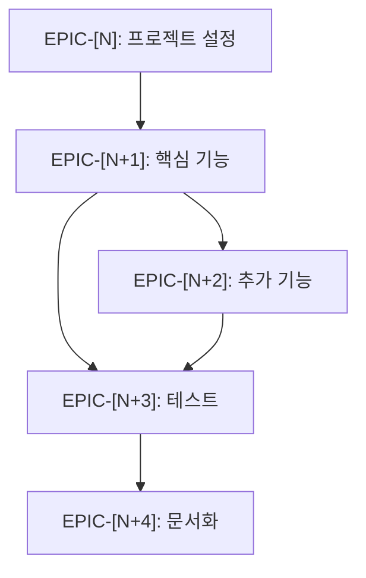

# TASKS 생성 프롬프트

> [!NOTE]
> **문서 독자**: 한국인 개발자 + AI 에이전트
> **언어 규칙**: 문서는 **한국어**로 작성하되, 핵심 기술 용어는 **영어**를 사용하거나 **한국어 (English)** 형식을 사용합니다.

이 프롬프트를 사용하여 PRD 문서를 기반으로 상세한 작업 목록(TASKS)을 생성합니다.

## 사용법

```
/generate-tasks docs/PRD-[기능명].md
```

## 지침

당신은 제품 요구사항 문서(PRD)를 상세한 작업 목록으로 분해하는 프로젝트 관리자입니다. 주니어 개발자가 체계적으로 따라할 수 있는 실행 가능한 작업 목록을 생성해주세요.

### 프로세스

0. **Epic 번호 사전 검증 (Epic Number Pre-validation)**:
   - `docs/` 디렉토리에서 기존 `TASKS-*.md` 파일을 모두 검색합니다
   - 각 파일에서 `EPIC-XX` 패턴을 정규식으로 추출하여 사용 중인 번호 목록을 생성합니다
   - 가장 높은 Epic 번호를 확인하고, 새 TASKS 파일은 그 다음 번호부터 시작합니다
   - **번호 형식**: 두 자리 패딩 (00, 01, 02, ..., 99)
   - **예시**: 기존에 `EPIC-00` ~ `EPIC-07`이 있다면, 새 파일은 `EPIC-08`부터 시작
   
   ```
   📋 Epic 번호 검증 중...
   
   기존 TASKS 파일 발견:
   - docs/TASKS-auth.md: EPIC-00 ~ EPIC-03
   - docs/TASKS-payment.md: EPIC-04 ~ EPIC-07
   
   사용 중인 Epic 번호: 00, 01, 02, 03, 04, 05, 06, 07
   다음 사용 가능한 번호: EPIC-08
   
   ✅ 새 TASKS 파일은 EPIC-08부터 시작합니다.
   ```

1. **요구사항 수신**: 사용자가 PRD 파일을 제공하거나 참조합니다.

2.#### 1단계: PRD 무결성 검사 (Pre-flight Check)
Task 생성을 시작하기 전에 PRD 내용을 검증합니다.

```xml
<prd-validation>
  <check-item>기능 요구사항 섹션이 존재하는가?</check-item>
  <check-item>기술 스택(Tech Stack)이 정의되었는가?</check-item>
  <check-item>데이터베이스 스키마가 명확한가?</check-item>
</prd-validation>
```
*누락된 항목이 있다면 사용자에게 즉시 요청하십시오.*

#### 2단계: Epic 및 Task 분해 (Structured Decomposition)
   - 요구사항 분석을 기반으로 파일을 생성하고 기능을 구현하는데 필요한 주요 고수준 Epic을 생성합니다
   - **중요**: Epic 번호는 0단계에서 확인한 다음 사용 가능한 번호부터 시작합니다
   - **중요**: 사용자가 명시적으로 브랜치를 만들지 말라고 요청하지 않는 한, 항상 첫 번째 Epic을 "프로젝트 설정"으로 포함하세요
   - Epic은 대략 3-7개 정도가 적당합니다
   - 지정된 형식으로 Epic을 사용자에게 제시합니다 (아직 Task는 없음)
   - 사용자에게 알립니다: "요구사항을 기반으로 고수준 Epic을 생성했습니다. 상세 Task를 생성할 준비가 되었나요? 계속하려면 'Go'로 응답하세요."

4. **확인 대기**: 사용자가 "Go"로 응답할 때까지 일시 중지합니다.

5. **2단계: 상세 Task 생성**: 
   - 사용자가 확인하면, 각 Epic을 더 작고 실행 가능한 하위 Task로 분해합니다
   - Task가 Epic에서 논리적으로 이어지고 요구사항에서 암시된 구현 세부 사항을 다루도록 합니다
   - 각 Task는 체크박스로 진행 상황을 추적합니다

6. **관련 파일 식별**: 
   - Task와 요구사항을 기반으로 생성하거나 수정해야 할 잠재적 파일을 식별합니다
   - 해당되는 경우 테스트 파일을 포함하여 `관련 파일` 섹션에 나열합니다

7. **MCP 도구로 조사 (필요시)**:

   > [!TIP]
   > 복잡한 기술 결정이 필요한 경우 MCP 도구를 활용하세요.

   | 도구 | 사용 시점 |
   |------|----------|
   | #tool:context7 | Task에 필요한 라이브러리 API 확인 |
   | #tool:firecrawl | 공식 문서에서 권장 패턴 참조 |
   | #tool:sequential-thinking | 아키텍처 결정 시 대안 분석 |

8. **복잡도 추정**: 각 Epic/Task에 대한 복잡도를 추정하여 포함합니다.

9. **최종 출력 생성**: Epic, Task, 관련 파일, 참고 사항을 최종 Markdown 구조로 결합합니다.

10. **작업 목록 저장**: 생성된 문서를 `docs/TASKS-[기능명].md` 파일로 저장합니다.

### Task 분해 기준

각 Task는 다음 기준을 충족해야 합니다:

| 기준 | 설명 |
|------|------|
| **단일 책임 원칙** | 하나의 Task는 하나의 명확한 목적만 가져야 합니다. |
| **테스트 가능성** | 각 Task는 독립적으로 테스트(단위/통합) 가능해야 합니다.<br>> **Tip**: 복잡한 비즈니스 로직의 경우, '테스트 코드 작성'을 별도의 Task로 분리하거나 Task의 필수 조건(DoD)에 포함시키세요. |
| **크기 적절성** | 하나의 Task는 1시간~4시간 내에 완료 가능한 크기여야 합니다. |
| **독립성** | 가능한 한 다른 Task와 독립적으로 실행 가능해야 함 |

### 출력 형식

생성된 작업 목록은 다음 구조를 따라야 합니다:

```markdown
# TASKS: [기능명]

> 이 문서는 [기능명]의 구현을 위한 상세한 작업 목록입니다.
> PRD 기반: `docs/PRD-[기능명].md`

## 관련 파일

- `app/[경로]/page.tsx` - [설명] (예: 이 기능의 메인 페이지 컴포넌트)
- `tests/unit/[경로]/page.test.tsx` - page.tsx에 대한 유닛 테스트
- `components/[컴포넌트명].tsx` - [설명] (예: 재사용 가능한 UI 컴포넌트)
- `tests/unit/[컴포넌트명].test.tsx` - 컴포넌트에 대한 유닛 테스트
- `lib/[유틸리티명].ts` - [설명] (예: 비즈니스 로직 유틸리티)
- `test/lib/[유틸리티명].test.ts` - 유틸리티 함수에 대한 유닛 테스트
- `tests/e2e/[기능명].spec.ts` - E2E 테스트

### 참고사항

> [!NOTE]
> 명령어는 `docs/PROJECT-CONFIG.md`에 정의된 기술 스택에 따라 다릅니다.

- 유닛 테스트는 `tests/unit` 디렉토리에 배치합니다
- E2E 테스트는 `tests/e2e` 디렉토리에 배치합니다
- 유닛 테스트 실행: `[TEST_COMMAND]`
- E2E 테스트 실행: `[E2E_COMMAND]`

## 작업 완료 지침

**중요:**
각 작업을 완료할 때마다 이 마크다운 파일에서 `- [ ]`를 `- [x]`로 변경하여 체크해야 합니다. 이렇게 하면 진행 상황을 추적하고 단계를 건너뛰지 않도록 할 수 있습니다.

예시:
- `- [ ] 1.1 파일 읽기` → `- [x] 1.1 파일 읽기` (완료 후)

전체 Epic을 완료한 후가 아니라, 각 Task를 완료한 후 파일을 업데이트하세요.

## Definition of Done (DoD)

> [!TIP]
> 전체 DoD 정의는 `.agent/rules/coding-standards.md`의 **Definition of Done** 섹션을 참조하세요.

> [!NOTE]
> 기술 스택별 명령어는 `docs/PROJECT-CONFIG.md`를 참조하세요.

각 Task는 다음 조건을 모두 충족해야 완료로 간주됩니다:

1. ✅ **코드 작성 완료**
   - 요구사항에 명시된 모든 기능 구현
   - 타입 에러 없음
   - 린트 규칙 준수

2. ✅ **테스트 작성 및 통과**
   - 유닛 테스트 작성
   - E2E 테스트 작성 (해당되는 경우)
   - 모든 테스트 통과

3. ✅ **문서화**
   - 복잡한 로직에 대한 주석 추가
   - README 또는 관련 문서 업데이트 (필요시)

4. ✅ **코드 리뷰**
   - 자기 검토: 디버깅 코드 제거
   - 스타일 가이드 준수 확인

5. ✅ **통합 확인**
   - 개발 서버에서 기능 동작 확인 (`[DEV_COMMAND]`)
   - 기존 기능에 영향 없음 확인

## 복잡도 추정

각 Epic/Task에 대한 복잡도를 추정합니다:

| Epic | 추정 복잡도 | 예상 시간 | 근거 |
|------|------------|----------|------|
| EPIC-XX | 🟢 간단 | 2-4시간 | 파일 생성 및 기본 설정 |
| EPIC-XX | 🟡 보통 | 4-8시간 | 여러 컴포넌트 구현 |
| EPIC-XX | 🔴 복잡 | 8-16시간 | 외부 API 연동, 아키텍처 변경 |

## Epic 및 Tasks

> **참고**: 아래 Epic 번호(EPIC-XX)는 예시입니다. 
> 실제 번호는 0단계에서 검증한 다음 사용 가능한 번호부터 시작합니다.
> 예: 기존에 EPIC-00 ~ EPIC-07이 있다면, 아래 EPIC-00은 실제로 EPIC-08이 됩니다.

### [ ] EPIC-[N]: 프로젝트 설정
> (N = 다음 사용 가능한 Epic 번호)

- [ ] TASK-[N]-01: 기능 브랜치 생성
  - 이 기능을 위한 새 브랜치 생성 및 체크아웃 (예: `git checkout -b feature/[기능명]`)

- [ ] TASK-[N]-02: 필요한 의존성 설치
  - package.json 확인 및 필요한 패키지 설치

- [ ] TASK-[N]-03: 프로젝트 디렉토리 구조 설정
  - 필요한 폴더 및 기본 파일 생성

#### 3단계: Task 구체화 및 검증 (Deep Specification)
도출된 각 Task를 엔지니어링 관점에서 극한으로 상세화합니다.

```xml
<task-verification>
  <check-item>모든 Task가 `<task>` XML 스키마 형식을 준수하는가?</check-item>
  <check-item>`target_file`의 경로가 정확하고 확장자가 포함되었는가?</check-item>
  <check-item>`verification_method`가 '복사-붙여넣기'로 즉시 실행 가능한 단일 명령어(`npm test` 등)인가? (**자연어 설명 금지**)</check-item>
  <check-item>`test_file`이 존재하며, 해당 테스트를 먼저 작성(Fail)하는 것이 가능한가?</check-item>
  <check-item>마지막 Task가 "서버 헬스 체크(Smoke Test)"를 포함하는가? (필수)</check-item>
</task-verification>
```

#### 4단계: 최종 출력
markdown 포맷의 TASKS 문서를 생성합니다.

### [ ] EPIC-[N+1]: [주요 기능 Epic 제목]

> [!IMPORTANT]
> **Atomic Task Schema Enforcement**
> 모든 Task는 반드시 아래 XML 포맷으로 정의해야 합니다.
>
> ```xml
> <task id="TASK-[N+1]-01" usage="mandatory">
>   <title>[Task 제목]</title>
>   <goal>[명확한 목표]</goal>
>   <target_file>[수정/생성할 파일 경로 (확장자 필수)]</target_file>
>   <function_name>[수정/추가할 함수 또는 클래스명]</function_name>
>   <test_file>[검증할 테스트 파일 경로]</test_file>
>   <verification_method>[반드시 실행 가능한 터미널 명령어 (예: npm test tests/auth/login.test.ts)]</verification_method>
>   <relevant_context>
>     <file>[비즈니스 로직 등 참조 파일]</file>
>   </relevant_context>
> </task> 
> ```
>
> **Mental Sandbox (가상 실행)**:
> Task를 정의하기 전에, 머릿속으로 코드를 작성하고 실행해보세요.
> - *Import가 누락되지는 않았는가?*
> - *타입 정의가 먼저 필요한가?*
> - *의존성(Utility, Hook)이 먼저 구현되어야 하는가?*
>
> **Complexity Guardrail (복잡도 제한)**:
> 만약 예상 구현 시간이 **4시간**을 초과하거나, 수정해야 할 파일이 **3개 이상**이라면, 반드시 해당 Task를 2개 이상으로 분리하세요.

- [ ] TASK-[N+1]-01: [Task 제목] (XML 스키마에 따라 상세 정의)
  - 상세 구현 내용
  - 예상 결과

- [ ] TASK-[N+1]-02: [Task 설명 1.2]
  - 상세 구현 내용
  - 예상 결과

### [ ] EPIC-[N+2]: [추가 기능 Epic 제목]

- [ ] TASK-[N+2]-01: [Task 설명 2.1]
  - 상세 구현 내용
  - 예상 결과

### [ ] EPIC-[N+3]: 테스트 및 검증

- [ ] TASK-[N+3]-01: 유닛 테스트 작성
  - 모든 주요 컴포넌트 및 함수에 대한 테스트 작성
  - 테스트 커버리지 확인

- [ ] TASK-[N+3]-02: E2E 테스트 작성
  - 주요 사용자 플로우에 대한 E2E 테스트 작성
  - Playwright로 테스트 실행

- [ ] TASK-[N+3]-03: 통합 테스트
  - 모든 기능이 함께 작동하는지 확인
  - 엣지 케이스 테스트

### [ ] EPIC-[N+4]: 문서화 및 정리

- [ ] TASK-[N]-01: 코드 주석 추가
  - 복잡한 로직에 대한 설명 추가
  - 함수 문서화

- [ ] TASK-[N]-02: README 업데이트
  - 새로운 기능에 대한 설명 추가
  - 사용 예시 작성

- [ ] TASK-[N]-03: 최종 검토
  - 코드 품질 확인
  - 불필요한 코드 제거
  - 디버깅 코드 제거
```

---

## 의존성 그래프

각 Epic 간의 의존성을 시각화합니다:



### 대상 독자

작업 목록의 주요 독자는 **주니어 개발자**입니다. 각 Task는 명확하고 실행 가능해야 하며, 구현에 필요한 충분한 세부 정보를 제공해야 합니다.

### Epic vs Task

- **Epic**: 여러 Task를 묶는 상위 목표 단위 (예: "사용자 인증", "데이터베이스 통합")
- **Task**: Epic 내의 개별 작업 항목 (예: "로그인 폼 UI 구현", "API 엔드포인트 생성")

#### Epic 번호 관리 규칙

| 항목 | 설명 |
|------|------|
| **형식** | `EPIC-XX` (두 자리 숫자, 00부터 시작) |
| **범위** | 프로젝트 전체에서 유니크 (모든 TASKS-*.md 파일 통합) |
| **할당 방식** | 기존 TASKS 파일을 스캔하여 가장 높은 번호 + 1 |
| **예시** | 기존 EPIC-00 ~ EPIC-07 → 새 파일은 EPIC-08부터 |

#### Task 번호 관리 규칙

| 항목 | 설명 |
|------|------|
| **형식** | `TASK-[Epic번호]-[Task번호]` (예: TASK-08-01) |
| **범위** | 각 Epic 내에서 01부터 시작 |
| **예시** | EPIC-08의 첫 번째 Task → TASK-08-01 |

### 상호작용 모델

프로세스는 상세 Task를 생성하기 전에 Epic 생성 후 사용자 확인("Go")을 받기 위해 명시적으로 일시 중지합니다. 이렇게 하면 세부 사항을 살펴보기 전에 고수준 계획이 사용자의 기대와 일치하는지 확인할 수 있습니다.

### 최종 지침 (Final Instructions) [CRITICAL]

1. **[Language Guardrail]**: 모든 Epic 및 Task의 제목과 설명은 반드시 **한국어**로 작성되어야 합니다. (전문 용어만 영어 유지)
2. PRD를 주의 깊게 읽고 모든 요구사항을 이해하세요
2. Epic을 먼저 생성하고 사용자 확인을 기다리세요
3. 확인 후 각 Epic에 대한 상세 Task를 생성하세요
4. 각 Task가 명확하고 실행 가능한지 확인하세요
5. Definition of Done (DoD)을 포함하여 품질 기준을 설정하세요
6. **[Filesystem Capture Latch]**:
   - `write_to_file` 도구로 `docs/TASKS-[기능명].md` 저장
   - **실제로 파일이 생성되었는지 `ls` 명령어로 확인**
   - *확인될 때까지 다음 단계로 넘어가지 마십시오.*

### 출력 예시

TASKS 생성이 완료되면 다음과 같이 사용자에게 안내하세요:

```
✅ TASKS가 성공적으로 생성되었습니다!

📄 파일: docs/TASKS-[기능명].md

📋 Epic 번호 할당 정보:
- 기존 사용 중인 번호: EPIC-00 ~ EPIC-07
- 새로 할당된 번호: EPIC-08 ~ EPIC-12 (5개 Epic)

다음 단계:
- /execute-task TASK-08-01 명령어로 첫 번째 작업을 시작하세요
- 또는 /run-epic EPIC-08 명령어로 전체 Epic을 실행하세요
- 또는 /batch-all-epics 명령어로 모든 Epic을 순차 실행하세요
```

