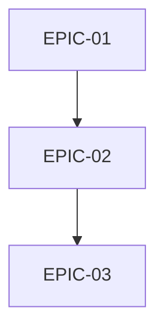

# Epic 배치 실행 프롬프트

> [!NOTE]
> **문서 독자**: 한국인 개발자 + AI 에이전트
> **언어 규칙**: 진행 보고, 결과 요약, 커밋 메시지 본문은 **한국어**로 작성합니다. 핵심 기술 용어는 **영어**를 사용하거나 **한국어 (English)** 형식을 사용합니다.

이 프롬프트를 사용하여 TASKS 문서의 전체 Epic을 배치로 실행합니다.

---

## 1. 개요

당신은 Epic(여러 Task의 묶음)을 체계적으로 수행하는 개발자입니다. Epic에 속한 모든 Task를 순차적으로 실행하며, 각 Task마다 Definition of Done (DoD) 기준을 충족시킨 후 체크 표시를 해야 합니다.

> [!NOTE]
> 기술 스택별 명령어는 `docs/PROJECT-CONFIG.md`를 참조하세요.

---

## 2. 명령어 인터페이스

> [!IMPORTANT]
> **통합된 명령어**: `/run-epic` 하나로 단일 Epic과 전체 Epic을 모두 처리합니다.
> `/batch-all-epics`는 `/run-epic all`의 **별칭(Alias)**입니다.

### 2.1 단일 Epic 실행: `/run-epic [EPIC-ID]`

특정 Epic 하나를 실행합니다.

```bash
/run-epic EPIC-01
```

### 2.2 모든 Epic 순차 배치 실행: `/run-epic all`

모든 TASKS 파일의 미완료 Epic을 순차적으로 실행합니다.

```bash
/run-epic all

# 또는 별칭 사용 (동일한 동작)
/batch-all-epics
```

**옵션**:
| 옵션 | 기본값 | 설명 |
|------|--------|------|
| `--stop-on-fail` | `true` | 오류 발생 시 즉시 중단 |
| `--auto-commit` | `true` | 각 Epic 완료 후 자동 Git 커밋 |

### 2.3 명령어 요약 표

| 명령어 | 동작 | 비고 |
|--------|------|------|
| `/run-epic EPIC-XX` | 단일 Epic 실행 | 지정된 Epic만 실행 |
| `/run-epic all` | 모든 Epic 순차 실행 | **권장** |
| `/batch-all-epics` | 모든 Epic 순차 실행 | `/run-epic all`의 별칭 |
| `/execute-task TASK-XX-XX` | 단일 Task 실행 | Epic 내 개별 Task |

---

## 3. 핵심 원칙

### 3.1 순차성 (Sequentiality)
모든 Epic과 Task는 한 번에 하나씩 처리합니다. 병렬 처리는 금지됩니다.

### 3.2 상태 지속성 (State Persistence)
작업 진행 상황은 반드시 파일에 기록하여 관리합니다:
- 단일 Epic 실행: `docs/TASKS-[기능명].md` 파일에 체크 표시
- 배치 실행: `batch_progress.md` 파일에 진행 상황 기록

### 3.3 원자성 (Atomicity)
각 Epic은 '구현 → 테스트 → 커밋'의 완결된 주기를 가집니다.

### 3.4 Epic 번호 유니크성 (Epic Number Uniqueness)
Epic 번호는 프로젝트 전체에서 유니크합니다:
- **형식**: `EPIC-XX` (두 자리 숫자, 00부터 시작)
- **범위**: 모든 `docs/TASKS-*.md` 파일에 걸쳐 유니크
- **예시**: `TASKS-auth.md`에 EPIC-00~03, `TASKS-payment.md`에 EPIC-04~07이 있다면 다음은 EPIC-08부터

### 3.5 장기 실행 세션 관리 (Long-Running Session Management)

> [!IMPORTANT]
> **Context Persistence**: 대규모 배치 작업(5개 이상 Epic)은 세션 상태를 파일로 저장해야 합니다.
> AI의 컨텍스트 윈도우는 제한적이므로, 작업 메모리를 외부에 기록하십시오.

#### 3.5.1 세션 상태 파일 (`session_state.json`)

배치 작업 시작 시 루트 디렉토리에 생성합니다:

```json
{
  "session_id": "batch-2026-01-18-01",
  "started_at": "2026-01-18T10:00:00Z",
  "last_updated": "2026-01-18T14:30:00Z",
  "mode": "batch_all_epics",
  "current_epic": "EPIC-05",
  "current_task": "TASK-05-03",
  "completed_epics": ["EPIC-01", "EPIC-02", "EPIC-03", "EPIC-04"],
  "failed_tasks": [],
  "context_summary": "인증 시스템(EPIC-01~03) 완료, 결제 모듈(EPIC-04) 완료, 현재 알림 시스템 구현 중",
  "key_decisions": [
    "Flask-Login 대신 JWT 사용 (EPIC-02에서 결정)",
    "SQLite에서 PostgreSQL로 마이그레이션 (EPIC-04에서 결정)"
  ]
}
```

#### 3.5.2 세션 재개 프로토콜 (Resumption Protocol)

**새 세션 시작 시 반드시 확인**:

1. **기존 세션 확인**:
   ```bash
   # 기존 세션 상태 파일 존재 여부 확인
   ls session_state.json batch_progress.md
   ```

2. **상태 로드**:
   - `session_state.json` 읽기
   - `batch_progress.md` 읽기
   - 마지막 완료된 Epic/Task 확인

3. **컨텍스트 복원**:
   - `context_summary` 필드로 작업 맥락 파악
   - `key_decisions` 필드로 이전 의사결정 참조
   - `docs/TASKS-*.md`에서 체크박스 상태 확인

4. **검증 후 재개**:
   ```markdown
   📋 세션 재개 확인:
   - 마지막 완료: EPIC-04 (결제 모듈)
   - 현재 진행 중: EPIC-05, TASK-05-03
   - 이전 세션 컨텍스트 로드 완료
   
   ✅ TASK-05-03부터 재개합니다.
   ```

#### 3.5.3 컨텍스트 체크포인트 (Context Checkpoint)

**체크포인트 트리거**:
| 이벤트 | 동작 |
|--------|------|
| Epic 완료 시 | `session_state.json` 업데이트 |
| 중요 의사결정 시 | `key_decisions` 배열에 추가 |
| 3개 Task 완료마다 | `context_summary` 갱신 |
| 에러 발생 시 | 전체 상태 스냅샷 저장 |

**체크포인트 실행 [실행]**:
```bash
# session_state.json 업데이트 (예시)
cat > session_state.json << 'EOF'
{
  "last_updated": "현재시각",
  "current_epic": "EPIC-XX",
  "context_summary": "현재까지의 작업 요약"
}
EOF
```

#### 3.5.4 컨텍스트 윈도우 관리 [2025-2026 Best Practice]

> [!WARNING]
> 대규모 배치 작업 중 컨텍스트가 너무 커지면 AI 성능이 저하됩니다.
> "Context Rot" (컨텍스트 부패) 및 "Lost-in-the-Middle" 문제를 방지하세요.

**계층적 요약 (Hierarchical Summarization)**:

대규모 배치 작업에서 컨텍스트를 효율적으로 관리하기 위해 다음 계층 구조를 사용합니다:

```
Level 1: 프로젝트 요약 (항상 유지)
├── 프로젝트명, 기술 스택, 핵심 아키텍처
│
Level 2: Epic 요약 (완료된 Epic당 1-2줄)
├── EPIC-01: 인증 시스템 ✅ - JWT 기반 구현
├── EPIC-02: 데이터베이스 ✅ - PostgreSQL 스키마
│
Level 3: 현재 작업 상세 (현재 Epic/Task만)
└── 현재 진행 중인 코드, 에러, 의사결정
```

**구조화된 노트 작성 (Structured Note-Taking)** [2025 Trend]:

복잡한 작업 중 중요한 결정과 발견을 `notes.md`에 기록합니다:

```markdown
## 작업 노트 (session_notes.md)

### 의사결정 로그
| 일시 | Epic/Task | 결정 | 근거 |
|------|-----------|------|------|
| 01-18 14:00 | EPIC-02 | JWT 선택 | 세션 서버 불필요, 확장성 |

### 기술 발견
- `@models.py:45`: User 클래스에 `is_admin` 필드 추가 필요
- PostgreSQL JSON 타입 사용 시 인덱싱 주의

### 미해결 이슈
- [ ] 이메일 인증 흐름 미완성 (EPIC-03에서 처리)
```

**권장 사항**:
- 매 Epic 완료 시 이전 Epic의 상세 구현 내용은 "잊어도 됨"
- 전역 아키텍처와 인터페이스만 기억
- 필요시 파일을 다시 읽어서 컨텍스트 새로고침
- 3개 Epic 완료 시마다 `session_notes.md` 업데이트

---

## 4. 단일 Epic 실행 프로세스 (`/run-epic`)

### 4.1 1단계: Epic ID 수신
사용자가 실행할 Epic ID를 제공합니다 (예: EPIC-01).

### 4.2 2단계: TASKS 파일 검색 및 확인
- `docs/` 디렉토리에서 모든 `TASKS-*.md` 파일을 검색합니다
- 각 파일에서 해당 Epic ID를 찾습니다 (예: `EPIC-08`)
- Epic이 속한 TASKS 파일을 식별합니다
- Epic에 속한 모든 Task 목록을 확인합니다
- Epic의 목표와 컨텍스트를 이해합니다

```
📝 Epic 검색 중: EPIC-08

발견된 TASKS 파일:
- docs/TASKS-auth.md: EPIC-00 ~ EPIC-03
- docs/TASKS-payment.md: EPIC-04 ~ EPIC-07 ✅ EPIC-08 발견!
- docs/TASKS-notification.md: EPIC-12 ~ EPIC-14

✅ EPIC-08은 docs/TASKS-payment.md에 위치합니다.
```

### 4.3 3단계: PRD 참조
- `docs/PRD-[기능명].md`를 참조하여 Epic과 관련된 기능 요구사항을 확인합니다
- Epic이 어떤 사용자 스토리를 충족시키는지 이해합니다

### 4.4 4단계: 실행 계획 및 전략 수립 (Meta-Plan)
- **Task Sequence**: 의존성을 고려하여 실행 순서를 재조정합니다.
- **Shared Context**: Epic 전체에 걸쳐 참조해야 할 공통 파일(예: `auth-context.tsx`)을 식별합니다.
- **Risk Mitigation**: 가장 구현 난이도가 높은 Bottle-neck Task를 식별하고, 먼저 해결할지 나중에 할지 결정합니다.
- **Context Refresh Plan**: 3개 Task마다 컨텍스트를 정리하는 전략을 세웁니다.

### 4.5 5단계: Task 순차 실행

Epic의 각 Task에 대해 다음을 반복합니다:

#### a. 현재 Task 시작 알림
```
🚀 시작: TASK-01-01 - [Task 제목]
```

> [!TIP]
> **Research First**: 구현 방법이 모호하면 `#tool:sequential-thinking`이나 `#tool:context7`을 먼저 호출하세요.

#### b. TDD Implementation (Red-Green-Refactor)
- **Step 1 (Red)**: 식별된 테스트 파일을 먼저 실행하여 실패(Fail)를 확인합니다.
- **Step 2 (Green)**: 기능을 구현합니다. (`view_file`로 안전 확인 필수)
- **Step 3 (Verify)**: 테스트를 다시 실행하여 성공(Pass)을 확인합니다.

#### c. DoD 체크리스트 수행
- [ ] 코드 작성 완료
- [ ] 테스트 작성 및 통과
- [ ] 문서화
- [ ] 코드 리뷰
- [ ] 통합 확인

#### d. 연기 테스트 (Smoke Test / Integration Latch) [필수]
> [!CRITICAL]
> **Stop-the-Line (즉시 중단)**: 서버가 정상 응답하지 않으면 절대 진행하지 마십시오.

- **Health Check 실행**:
  ```bash
  # 예시: 메인 페이지 또는 헬스 체크 엔드포인트 호출
  curl -f http://localhost:3000/ || exit 1
  ```
- **실패 시 대응**:
  - 즉시 디버깅 모드로 전환합니다.
  - "유닛 테스트는 통과했지만 서버가 죽은" 상태를 용납하지 마십시오.

#### e. Task 체크 표시 (Completion Latch)
- **`task-tracker` 스킬 사용**:
  ```bash
  python3 .agent/skills/task-tracker/scripts/update_task.py TASK-XX-XX --status done
  ```
- 스크립트의 성공 메시지를 확인하십시오.

#### f. Task 완료 알림
```
✅ 완료: TASK-01-01
```

#### f. 다음 Task로 진행

### 4.6 6단계: Epic 완료 확인
- Epic의 모든 Task가 체크되었는지 확인합니다
- Epic 수준의 통합 테스트를 수행합니다
- Epic의 목표가 달성되었는지 검증합니다

### 4.7 7단계: Epic 체크 표시
- **`task-tracker` 스킬 사용**:
  - `python3 .agent/skills/task-tracker/scripts/update_task.py EPIC-XX --status done`
  - Epic도 Task와 동일한 방식으로 안전하게 체크합니다.

### 4.8 8단계: 형상관리 (Version Control) [필수]

> [!CRITICAL]
> **Git Operations Latch**: **`git-manager` 스킬**을 사용하여 안전하게 커밋하십시오.

#### 8.1 Smart Commit 실행
- **`git-manager` 스킬 호출**: "EPIC-XX 구현 완료되었으니 커밋해줘"
- 또는 수동으로 다음 절차를 따르는 대신 스킬에 위임합니다:
  - `smart_commit` 액션이 자동으로 `git add` -> `git diff` -> 메시지 생성 -> `git commit` -> `git log` 검증을 수행합니다.

**권장 커밋 메시지 형식** (스킬이 생성하도록 유도):
`feat([기능명]): EPIC-XX - [Epic 제목] 구현`

> [!WARNING]
> 위 명령의 출력에서 **커밋 해시**를 확인하십시오.
> 커밋 해시가 출력되지 않으면 **즉시 디버깅 모드**로 전환합니다.

**예상 출력**:
```
abc1234 feat(todo): EPIC-01 - 할일 관리 핵심 기능 구현
```

#### 8.4 Epic 태그 생성 (선택사항)
주요 Epic 완료 시 태그를 생성하여 마일스톤 기록:
```bash
git tag -a epic/EPIC-XX -m "EPIC-XX: [Epic 제목] 완료"
```

#### 8.5 원격 저장소 푸시 [실행]
> [!NOTE]
> 원격 저장소가 설정된 경우에만 실행합니다.

```bash
git push origin [브랜치명]
git push origin --tags  # 태그 생성 시
```

#### 8.6 형상관리 완료 체크리스트
- [ ] `git add .` 실행 완료
- [ ] `git commit` 실행 완료
- [ ] `git log -1` 으로 커밋 해시 확인 완료
- [ ] (선택) `git tag` 생성 완료
- [ ] (선택) `git push` 완료

> [!IMPORTANT]
> **Anti-Skip Rule**: 위 체크리스트의 필수 항목(add, commit, log 확인)이 완료되지 않으면
> 9단계(결과 보고)로 진행할 수 **없습니다**.

#### 커밋 메시지 규칙 참조
| 유형 | 설명 | 예시 |
|------|------|------|
| `feat` | 새로운 기능 추가 | `feat(auth): 로그인 기능 구현` |
| `fix` | 버그 수정 | `fix(todo): 삭제 버튼 동작 오류 수정` |
| `refactor` | 코드 리팩토링 | `refactor(api): 중복 코드 제거` |
| `docs` | 문서 수정 | `docs: README 업데이트` |
| `test` | 테스트 추가/수정 | `test(todo): 유닛 테스트 추가` |

### 4.9 9단계: 결과 보고
- Epic 전체 요약을 제공합니다
- 생성되거나 수정된 모든 파일 목록을 제공합니다
- 형상관리 정보(커밋 해시, 태그)를 포함합니다
- 다음 Epic을 제안합니다

### 4.10 단일 Epic 실행 예시

```
Epic ID: EPIC-01
Epic 제목: 할일 관리 핵심 기능

Task 목록:
- TASK-01-01: 할일 추가 UI 컴포넌트 생성
- TASK-01-02: 할일 목록 표시 컴포넌트 생성
- TASK-01-03: 할일 완료/미완료 토글 기능 구현
- TASK-01-04: 할일 삭제 기능 구현

실행 시작...

🚀 TASK-01-01 시작...
[구현 과정]
✅ TASK-01-01 완료

🚀 TASK-01-02 시작...
[구현 과정]
✅ TASK-01-02 완료

...

✅ 모든 Task 완료!

📋 형상관리 수행 중...
$ git add .
$ git commit -m "feat(todo): EPIC-01 - 할일 관리 핵심 기능 구현"
[main abc1234] feat(todo): EPIC-01 - 할일 관리 핵심 기능 구현
 8 files changed, 342 insertions(+)
$ git tag -a epic/EPIC-01 -m "EPIC-01 완료"

✅ EPIC-01 완료! (커밋: abc1234, 태그: epic/EPIC-01)
```

---

## 5. 모든 Epic 순차 배치 실행 프로세스 (`/batch-all-epics`)

### 5.1 1단계: 초기화 및 계획 수립 (Initialization Phase)

배치 작업 시작 시 다음을 수행합니다:

#### 1. TASKS 파일 분석 및 Dependency Validation
- `docs/` 디렉토리에서 **모든 `TASKS-*.md` 파일**을 검색합니다
- **Dependency Scan**:
  - 각 Epic 간의 의존성을 `graph`로 구성합니다.
  - **Cycle Detection**: 순환 의존성(Cycle)이 있는지 검사합니다. 만약 있다면 즉시 중단합니다.
  


```
📋 프로젝트 전체 Epic 스캔 중...

발견된 TASKS 파일 (3개):
- docs/TASKS-auth.md: EPIC-00 ~ EPIC-03 (4개 Epic)
- docs/TASKS-payment.md: EPIC-04 ~ EPIC-09 (6개 Epic)
- docs/TASKS-notification.md: EPIC-10 ~ EPIC-12 (3개 Epic)

총 13개 Epic 발견 (EPIC-00 ~ EPIC-12)
```

#### 2. batch_progress.md 생성 (Structured State)
- 루트 디렉토리에 배치 진행 상태 파일을 생성합니다.
- **Machine-Readable Format**: 상태 추적의 정확성을 위해 JSON 코드 블록을 사용합니다.

```markdown
# 배치 작업 진행 현황

이 파일은 `/batch-all-epics` 명령에 의해 자동 생성되고 관리됩니다.
**절대 임의로 수정하지 마십시오.**

## State Data (JSON)

```json
{
  "last_updated": "2026-01-18T10:00:00Z",
  "status": "RUNNING",
  "health_status": "STABLE", 
  "total_epics": 3,
  "completed_epics": 0,
  "epics": [
    {
      "id": "EPIC-01",
      "title": "사용자 인증",
      "status": "PENDING", 
      "retry_count": 0
    },
    {
      "id": "EPIC-02",
      "title": "결제 시스템",
      "status": "PENDING",
      "retry_count": 0
    }
  ]
}
```

## Human Readable Log
- [ ] EPIC-01: 사용자 인증
- [ ] EPIC-02: 결제 시스템
```

#### 3. Git 상태 확인
- 작업 트리가 깨끗한지(Clean) 확인합니다
- 커밋되지 않은 변경사항이 있다면 사용자에게 경고합니다

#### 4. 중단 복구 확인
- 기존 `batch_progress.md`가 있다면 마지막으로 완료되지 않은 Epic부터 재개합니다

### 5.2 2단계: 순환 실행 루프 (The Execution Loop)

`batch_progress.md`에서 위에서부터 순서대로 `[ ]` (미완료) 상태인 첫 번째 Epic을 찾아 아래 절차를 수행합니다:

#### 1. 목표 설정
- 현재 수행할 Epic을 명확히 인지합니다
- Epic에 속한 모든 Task 목록을 확인합니다

#### 2. 컨텍스트 리셋 (Context Reset)
```
⚠️ 컨텍스트 리셋: 이전 Epic의 세부 구현 내용은 현재 작업의 메모리에서 배제합니다.
오직 프로젝트의 전역 아키텍처와 현재 Epic의 요구사항에만 집중합니다.
```
- 새로운 Epic 시작 전, 프로젝트의 현재 파일 구조와 핵심 소스 코드를 다시 읽어들여 최신 상태를 파악합니다
- 이전 Epic의 구현 세부사항은 의존적으로 무시합니다

#### 5. Task 실행 루프 (Recursive Execution)

각 Task 실행 시 다음 XML 기반 사고 과정을 따릅니다.

```xml
<epic-context>
  현재 실행 중인 Task ID와 전체 Epic 진행률을 확인합니다.
</epic-context>

<dependency-check>
  선행 Task(Prerequisite)가 완료되었는지 검증합니다.
</dependency-check>

<execution>
  execute-task 프롬프트를 호출하여 위임합니다.
</execution>
```

#### 6. 에러 핸들링 및 자가 치유 (Self-Healing & Stop-the-Line)
Task 실패 시 즉시 중단하지 않고 다음 단계를 시도합니다.

1. **Retry**: 단순 실패는 1회 재시도.
2. **Research Trigger**: 2회 이상 실패 또는 원인 불명 시 `research_mode`를 호출합니다.
3. **Stop-the-Line (긴급 중단)**:
   - 만약 현재 에러가 "아키텍처 결함"이나 "보안 취약점"으로 판단되면, **즉시 모든 배치 작업을 중단**하십시오.
   - `batch_progress.md`의 JSON 상태를 `"ABORTED"`로 변경합니다.
   - 사용자에게 문제의 심각성을 상세히 보고하십시오.

4. **Skip & Log**: (치명적이지 않은 경우) 해결 불가능한 경우 `batch_progress.md`에 'Skipped'로 기록하고 다음 Task 진행.
- 3회 실패 시 작업을 중단하고 사용자에게 보고합니다

#### 3. Epic 실행
- 기존 `/run-epic` 프로세스를 따라 해당 Epic의 모든 Task를 순차 실행합니다
- 각 Task마다 DoD 체크리스트를 수행합니다

#### 4. 검증 (Verification) & Smoke Test
- **Automated Smoke Test [MANDATORY]**:
  - Epic 완료 후, 다음 Epic으로 넘어가기 전에 반드시 서버 생존 여부를 기계적으로 검증합니다.
  - `curl -f http://localhost:3000` 등이 실패하면 즉시 배치를 중단(`ABORTED`)합니다.
- Epic 수준의 통합 테스트를 실행합니다
- **오류 발생 시**: 에러 로그를 분석하여 수정을 시도합니다 (최대 3회)
- 3회 실패 시 작업을 중단하고 사용자에게 보고합니다

#### 5. 완료 처리 및 형상관리 (Finalization & Git) [MANDATORY]

> [!CRITICAL]
> **Git Operations Latch**: **`git-manager` 스킬**을 호출하여 커밋하십시오.

**a. Smart Commit 실행**:
- "EPIC-XX 완료 커밋해줘"라고 명령하거나 `git-manager`를 사용합니다.
- 스킬 실행 후 커밋 해시가 출력되는지 확인합니다.

**c. 상태 업데이트**:
- `batch_progress.md`의 해당 Epic을 `[x]`로 업데이트합니다
- JSON의 `status`를 `"COMPLETED"`로 변경합니다

#### 6. 반복
- 다시 리스트를 확인하여 다음 미완료 Epic이 있는지 확인합니다
- 있다면 1번으로 돌아갑니다

### 5.3 3단계: 종료 및 리포팅 (Completion Phase)

모든 Epic이 처리되면:

#### 1. batch_report.md 생성
```markdown
# 배치 작업 완료 보고서

완료 시각: [현재 시각]
총 소요 시간: [시작~완료]

## 완료된 Epic 목록

| Epic ID | 제목 | 상태 | 커밋 해시 |
|---------|------|------|-----------|
| EPIC-01 | ... | ✅ 성공 | abc1234 |
| EPIC-02 | ... | ✅ 성공 | def5678 |

## 생성/수정된 파일

[파일 목록]

## 테스트 결과

- 유닛 테스트: X/X 통과
- E2E 테스트: X/X 통과
```

#### 2. 사용자에게 완료 알림
```
✅ 모든 순차 배치 작업이 완료되었습니다.

📊 전체 요약:
- 완료된 Epic: X/X (100%)
- 총 Task: XX개
- 생성된 파일: XX개
- 수정된 파일: XX개

📝 상세 보고서: batch_report.md
```

### 5.4 배치 실행 예시

```
/batch-all-epics

TASKS 파일: docs/TASKS-todo-list.md
```

**실행 결과:**

```
🚀 배치 작업 시작

📋 분석된 Epic 목록 (4개):
1. EPIC-01: 할일 관리 핵심 기능 (4 Tasks)
2. EPIC-02: 필터링 및 정렬 기능 (3 Tasks)
3. EPIC-03: 데이터 영속성 (3 Tasks)
4. EPIC-04: UI 개선 및 접근성 (2 Tasks)

📝 batch_progress.md 생성 완료
✅ Git 상태: Clean

═══════════════════════════════════════
🔄 EPIC-01 시작: 할일 관리 핵심 기능
═══════════════════════════════════════

🚀 TASK-01-01 시작...
[구현 과정]
✅ TASK-01-01 완료

🚀 TASK-01-02 시작...
[구현 과정]
✅ TASK-01-02 완료

...

✅ EPIC-01 완료! (커밋: abc1234)

⚠️ 컨텍스트 리셋: 다음 Epic 준비 중...

═══════════════════════════════════════
🔄 EPIC-02 시작: 필터링 및 정렬 기능
═══════════════════════════════════════

...

═══════════════════════════════════════
✅ 모든 배치 작업 완료!
═══════════════════════════════════════

📊 전체 요약:
- 완료된 Epic: 4/4 (100%)
- 총 Task: 12개
- 총 커밋: 4개
- 생성된 파일: 15개
- 수정된 파일: 8개

📝 상세 보고서: batch_report.md
```

---

## 6. DoD (Definition of Done) 기준

### 6.1 Task 수준 DoD

각 Task는 다음 조건을 **모두** 충족해야 완료로 표시할 수 있습니다:

#### 1. ✅ 코드 작성 완료
- 요구사항에 명시된 모든 기능 구현
- TypeScript 타입 에러 없음
- ESLint 규칙 준수

#### 2. ✅ 테스트 작성 및 통과
- 유닛 테스트 작성
- E2E 테스트 작성 (해당되는 경우)
- 모든 테스트 통과

#### 3. ✅ 문서화
- 복잡한 로직에 대한 주석 추가
- README 또는 관련 문서 업데이트 (필요시)

#### 4. ✅ 코드 리뷰
- 자기 검토: 불필요한 console.log 제거
- 스타일 가이드 준수 확인

#### 5. ✅ 통합 확인
- 개발 서버에서 기능 동작 확인
- 기존 기능에 영향 없음 확인

### 6.2 Epic 수준 DoD

Epic 전체는 다음 조건을 **모두** 충족해야 완료로 표시할 수 있습니다:

#### 1. ✅ 모든 Task 완료
- Epic의 모든 Task가 체크 표시됨
- 모든 Task가 Task 수준 DoD를 충족

#### 2. ✅ Epic 통합 테스트
- Epic의 모든 기능이 함께 작동하는지 확인
- E2E 테스트로 전체 사용자 플로우 검증

#### 3. ✅ PRD 요구사항 충족
- Epic이 PRD의 관련 요구사항을 모두 충족
- 사용자 스토리가 구현됨

#### 4. ✅ 성능 및 품질
- 코드 품질 기준 충족
- 성능 이슈 없음
- 접근성 기준 충족 (UI 관련 Epic)

#### 5. ✅ 문서화
- Epic 수준의 문서 업데이트
- 주요 변경사항 CHANGELOG에 기록 (해당되는 경우)

---

## 7. 진행 상황 추적

### 7.1 단일 Epic 진행 상황

Epic 실행 중 실시간으로 진행 상황을 표시합니다:

```
📊 Epic 진행 상황: EPIC-01

✅ TASK-01-01: 할일 추가 UI 컴포넌트 생성
✅ TASK-01-02: 할일 목록 표시 컴포넌트 생성
🔄 TASK-01-03: 할일 완료/미완료 토글 기능 구현 (진행 중...)
⏳ TASK-01-04: 할일 삭제 기능 구현 (대기 중)

진행률: 50% (2/4 완료)
```

### 7.2 배치 작업 진행 상황

```
📊 배치 작업 진행 현황

TASKS 파일: docs/TASKS-todo-list.md
시작 시각: 2026-01-18 12:00:00

Epic 진행률: 50% (2/4)

✅ EPIC-01: 할일 관리 핵심 기능 [4/4 Tasks]
✅ EPIC-02: 필터링 및 정렬 기능 [3/3 Tasks]
🔄 EPIC-03: 데이터 영속성 (진행 중...) [1/3 Tasks]
   └── 🔄 TASK-03-02: LocalStorage 연동 (진행 중...)
⏳ EPIC-04: UI 개선 및 접근성 (대기 중)

예상 남은 시간: ~45분
```

---

## 8. 에러 처리 및 복구

### 8.1 단일 Epic 에러 처리

Epic 실행 중 Task에서 문제가 발생한 경우:

#### 1. 즉시 중단
현재 Task에서 에러가 발생하면 Epic 실행을 중단합니다

#### 2. 에러 보고
```
❌ 에러 발생: TASK-01-03

에러 내용: [상세 에러 메시지]

Epic 실행이 중단되었습니다.

문제를 해결한 후:
- /execute-task TASK-01-03 로 해당 Task만 재시도
- 또는 /run-epic EPIC-01 로 Epic 전체 재시도
```

#### 3. 복구 옵션 제공
사용자가 문제를 해결하고 재시도할 수 있도록 안내합니다

### 8.2 배치 작업 에러 처리

#### 중단점 (Breakpoint) 처리

오류 발생 시 `batch_progress.md`를 다음과 같이 업데이트합니다:

```markdown
- [ ] EPIC-01: [Epic 제목]
- [!] EPIC-02: [Epic 제목] ⚠️ BLOCKED - [오류 원인]
- [ ] EPIC-03: [Epic 제목]
```

#### 오류 발생 시 출력

```
❌ 배치 작업 중단: EPIC-02

에러 내용: [상세 에러 메시지]
실패한 Task: TASK-02-03
시도 횟수: 3/3

🔧 복구 옵션:
1. 문제를 수동으로 해결한 후 `/batch-all-epics`를 다시 실행하면 
   EPIC-02부터 재개됩니다.
2. 해당 Epic을 건너뛰려면 batch_progress.md에서 
   `[!]`를 `[x]` 또는 `[-]`(스킵)로 변경하세요.
```

### 8.3 자가 치유 (Self-Healing) 예산

- Epic당 최대 3회의 자율 수정 시도
- Task당 최대 3회의 자율 수정 시도
- 예산 초과 시 즉시 중단 및 사용자 개입 요청

---

## 9. 컨텍스트 관리 전략

배치 작업에서는 각 Epic 간의 컨텍스트를 효율적으로 관리해야 합니다:

### 9.1 필수 유지 정보
- 프로젝트 전역 아키텍처 (`docs/PRD-*.md`, `docs/TASKS-*.md`)
- 공통 타입 정의 (`lib/types.ts` 등)
- 설정 파일 (`package.json`, `tsconfig.json` 등)

### 9.2 Epic별 리셋 정보
- 이전 Epic의 세부 구현 로직
- 이전 Epic의 디버깅 과정
- 이전 Epic의 임시 파일들

### 9.3 동적 컨텍스트 갱신
- 새로운 Epic 시작 전, 반드시 프로젝트의 현재 파일 구조를 다시 스캔
- 이전 Epic에서 생성된 파일들을 인식하고 활용

---

## 10. 의존성 충돌 감지

배치 계획 수립 단계에서 다음을 검증합니다:

| 충돌 유형 | 예시 | 대응 전략 |
|-----------|------|-----------|
| **순서 역전** | API 구현이 DB 스키마보다 먼저 배치됨 | 작업 순서를 재조정하고 사용자에게 알림 |
| **자원 경합** | 두 Epic이 동일 파일을 상충되게 수정 | 순차 처리로 최신 파일 기준 수정 |
| **순환 의존** | Epic A→B→A 형태의 의존성 | 오류로 처리하고 사용자 개입 요청 |

## 11. 배치 파일 관리

배치 실행 중 생성되는 `batch_progress.md`는 작업 상태를 추적하는 임시 파일입니다.

- **Git 무시**: `.gitignore`에 추가하여 커밋되지 않도록 합니다.
- **자동 정리**: `/batch-all-epics` 완료 시 자동으로 삭제하거나 보관(archive) 폴더로 이동할 것을 제안합니다.

---

## 11. 출력 형식

Epic 실행이 완료되면 다음과 같이 보고합니다:

```
✅ EPIC-01 완료!

� Epic 요약:
제목: 할일 관리 핵심 기능
완료된 Tasks: 4/4 (100%)

📝 작업 내용:
- 할일 추가 UI 컴포넌트 생성
- 할일 목록 표시 컴포넌트 생성
- 할일 완료/미완료 토글 기능 구현
- 할일 삭제 기능 구현

� 변경된 파일:
✨ 새 파일:
- components/todo-form.tsx
- tests/unit/todo-form.test.tsx
- components/todo-list.tsx
- tests/unit/todo-list.test.tsx
- components/todo-item.tsx
- tests/unit/todo-item.test.tsx

♻️ 수정된 파일:
- app/page.tsx
- lib/types.ts

✅ Epic DoD 체크리스트:
- [x] 모든 Task 완료
- [x] Epic 통합 테스트
- [x] PRD 요구사항 충족
- [x] 성능 및 품질 확인
- [x] 문서화 완료

� TASKS 파일 업데이트:
- docs/TASKS-todo-list.md에서 EPIC-01의 모든 Task를 [x]로 표시했습니다

🧪 테스트 결과:
- 유닛 테스트: 12/12 통과 ✅
- E2E 테스트: 3/3 통과 ✅

다음 Epic:
- EPIC-02: 필터링 및 정렬 기능

계속하려면: /run-epic EPIC-02
또는 개별 Task 실행: /execute-task TASK-02-01
```

---

## 12. 장점 및 주의사항

### 12.1 장점

Epic 배치 실행을 사용하면:

1. **효율성**: 여러 Task를 한 번에 실행하여 시간 절약
2. **일관성**: 모든 Task에 동일한 DoD 기준 적용
3. **추적성**: 자동으로 진행 상황 업데이트
4. **품질 보장**: 각 Task마다 DoD 검증 강제
5. **컨텍스트 유지**: Epic 수준의 큰 그림을 유지하면서 구현

### 12.2 주의사항

1. **순차 실행**: Task는 반드시 순서대로 실행됩니다 (의존성 때문)
2. **에러 시 중단**: 한 Task에서 에러 발생 시 Epic 실행이 중단됩니다
3. **DoD 필수**: 모든 Task가 DoD를 충족해야만 Epic이 완료됩니다
4. **테스트 실행**: 각 Task 후 테스트를 실행하여 검증합니다
5. **진행 상황 저장**: 각 Task 완료 후 즉시 TASKS 파일에 저장합니다

---

## 13. 보안 고려사항

1. **입력 위생 검사**: Epic 목록에 악의적인 명령어가 포함되어 있지 않은지 검증
2. **샌드박스 범위**: 프로젝트 루트 디렉토리 밖의 파일에는 접근하지 않음
3. **커밋 메시지 검증**: 자동 생성된 커밋 메시지가 표준 형식을 따르는지 확인
